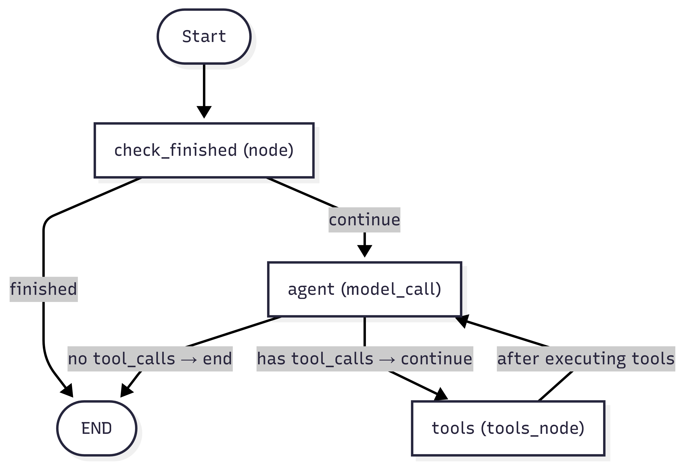
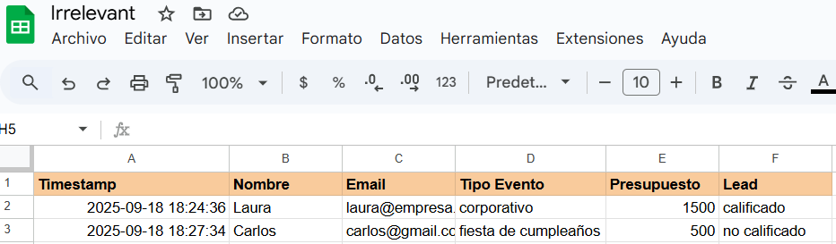

# 🤖 Agente Conversacional Irrelevant

**Prueba Técnica AI Engineer - LangGraph**  
**Desarrollado por:** Daniel Muñoz Puentes

💬 Un agente conversacional inteligente que **pre-califica leads para eventos corporativos**, integrando **LangGraph** y **Google Sheets**.  

En su núcleo simula un **ReAct Agent (razona y actúa)**, optimizando la experiencia conversacional y asegurando el cumplimiento del objetivo de negocio ⚡.

## 📋 Descripción del Proyecto

Este proyecto implementa un agente conversacional llamado **Frank** que trabaja para la empresa **Irrelevant** en Colombia. El agente está diseñado para:

- 🎯 Pre-calificar leads de eventos durante la conversación
- 📊 Guardar información estructurada en Google Sheets
- 🔄 Mantener estado de conversación usando LangGraph
- ✅ Aplicar reglas de negocio automáticamente

## 🏗️ Arquitectura del Grafo

El sistema utiliza un grafo de estados con LangGraph que sigue este flujo:

*Estructura visual del flujo conversacional implementado con LangGraph*

### Nodos del Grafo:

1. **`check_finished`**: Verifica si la conversación ya finalizó para evitar re-ejecución
2. **`agent`**: Modelo de IA (Gemini) que maneja la conversación
3. **`tools`**: Ejecuta herramientas (guardar datos y finalizar llamada)

### Herramientas Disponibles:

- **`save_information`**: Guarda datos del cliente en Google Sheets
- **`end_call`**: Finaliza la conversación

### Estados y Validación:

El agente mantiene un estado con:
- Mensajes de la conversación
- Flag de finalización (`finished`)
- Validación continua del flujo

## 💼 Reglas de Negocio

El agente aplica las siguientes reglas de calificación:

- ❌ **No Calificado**: Si no es evento corporativo
- ❌ **No Calificado**: Si presupuesto < USD 1,000
- ✅ **Calificado**: Evento corporativo + presupuesto ≥ USD 1,000 + contacto completo

## 🚀 Instalación y Configuración

### Requisitos:
- Python 3.13+ (recomendado)
- Cuenta de Google Cloud con API de Sheets habilitada
- API Key de Google Gemini

### Pasos de Instalación:

1. **Clona el repositorio:**
```bash
git clone https://github.com/camilomupu/prueba-tecnica-irrelevant.git
cd prueba-tecnica-irrelevant
```

2. **Instala dependencias:**
```bash
pip install -r requirements.txt
```

3. **Configuración de credenciales:**
   - Contacta al creador para recibir `credenciales.json`(conexion a sheets) y el archivo `.env`
   - Los archivos con las credenciales deben colocarse exactamente con esos nombres en la raíz del proyecto para que el agente los reconozca automáticamente.

4. **Ejecuta el agente:**
```bash
python main.py
```

5. **Selecciona el caso de prueba:**
   - Opción **1**: Caso de uso calificado (evento corporativo)
   - Opción **2**: Caso de uso no calificado (fiesta privada)
   - Opción **3**: Modo interactivo (conversación manual)

## 📊 Visualización del Sistema

### Selección de Casos de Uso
```
🤖 Agente Conversacional Irrelevant
========================================
Selecciona una opción:
1. Caso de uso calificado
2. Caso de uso no calificado
3. Modo interactivo
========================================
```

### Prueba de Guardado

*Demostración de datos guardados exitosamente en Google Sheets*

🔗 [Ver datos en Google Sheets](https://docs.google.com/spreadsheets/d/1gFg5SkqWjg7DYDU7i80iM00pvIV5jESjVlv7RY6G5lo/edit?usp=sharing)

## 🎮 Ejemplos de Uso

### 💬 Caso 1: Cliente Calificado ✅

```
🚀 Ejecutando Caso 1: Cliente Calificado
==================================================

👤 Usuario: Hola
🤖 Frank: Buen día. Le habla Frank en nombre de Irrelevant y estoy aquí para ayudarle. 
         Por favor deme el tipo de evento, presupuesto estimado, nombre y email 

👤 Usuario: Evento corporativo con presupuesto de 1500 dólares. 
           Me llamo Laura y mi correo es laura@empresa.com

🔧 Tool: save_information(presupuesto=1500, email="laura@empresa.com", 
         tipo_evento="corporativo", calificado="calificado", nombre="Laura")
📤 Return: "Dile al usuario que la información ha sido guardada y un asesor se pondrá en contacto con él."

🤖 Frank: Por favor, tenga en cuenta que la información ha sido guardada y un asesor se pondrá en contacto con usted.

👤 Usuario: Dale gracias

🔧 Tool: end_call()
📤 Return: "Despidete del usuario! Nuestra tarea ya fue realizada"

🤖 Frank: ¡Gracias a usted! Que tenga un excelente día.

👤 Usuario: Hola
🤖 Sistema: No te preocupes, ya registré tus datos. La conversación ha finalizado.
```

**Resultado:** ✅ El flujo se completa con éxito. La información se guarda en Google Sheets como **calificado**, Frank se despide y, tras el cierre, ya no responde más.

### 💬 Caso 2: Cliente No Calificado ❌

```
🚀 Ejecutando Caso 2: Cliente No Calificado       
==================================================

👤 Usuario: Hola
🤖 Frank: Buen día. Le habla Frank en nombre de Irrelevant y estoy aquí para ayudarle. 
         Por favor deme el tipo de evento, presupuesto estimado, nombre y email 

👤 Usuario: Necesito organizar una fiesta de cumpleaños, tengo 500 dólares de presupuesto. 
           Soy Carlos y mi email es carlos@gmail.com

🔧 Tool: save_information(presupuesto=500, tipo_evento="fiesta de cumpleaños", 
         email="carlos@gmail.com", calificado="no calificado", nombre="Carlos")
📤 Return: "Dile al usuario que la información ha sido guardada y un asesor se pondrá en contacto con él."

🤖 Frank: Ahora que la información ha sido guardada, me despido.

👤 Usuario: Perfecto, gracias

🔧 Tool: end_call()
📤 Return: "Despidete del usuario! Nuestra tarea ya fue realizada"

🤖 Frank: ¡Gracias por contactarnos, Carlos! Que tenga un excelente día.
```

**Resultado:** ❌ El flujo también se completa de manera correcta. La información se guarda en Google Sheets como **no calificado**, Frank se despide y finaliza la conversación.

## 🔧 Características Técnicas

- **Framework**: LangGraph para manejo de estados conversacionales
- **LLM**: Google Gemini 2.5 Flash Lite
- **Persistencia**: Google Sheets API
- **Memoria**: MemorySaver para mantener contexto de sesión
- **Validación**: Conditional edges para control de flujo

## ⚠️ Consideraciones Importantes

- **API Gratuita**: Pueden ocurrir errores al llamar la API de Gemini (capa gratuita). Reintenta la ejecución si es necesario.
- **Credenciales**: El proyecto requiere `credenciales.json` y `.env` para funcionar correctamente.
- **Memoria de Sesión**: El agente recuerda conversaciones por `thread_id` y evita re-procesar clientes ya atendidos.

## 🛠️ Tecnologías Utilizadas

- **LangGraph**: Orquestación de flujos conversacionales
- **Google Gemini**: Modelo de lenguaje natural
- **Google Sheets API**: Persistencia de datos
- **Python**: Lenguaje principal
- **gspread**: Cliente de Google Sheets

### 🔒 Control de Sesión
El sistema implementa un control robusto de finalización mediante `end_call`:
- Una vez ejecutada esta herramienta, el estado `finished` se marca como `True`
- El nodo `check_finished` intercepta todas las nuevas consultas del mismo `thread_id`
- **Ningún nuevo mensaje será procesado** por el agente, mostrando solo el mensaje: *"No te preocupes, ya registré tus datos. La conversación ha finalizado."*
- Esto previene re-procesamiento de clientes ya atendidos y mantiene la integridad de los datos

---

*Desarrollado como parte de la prueba técnica para AI Engineer - LangGraph*
